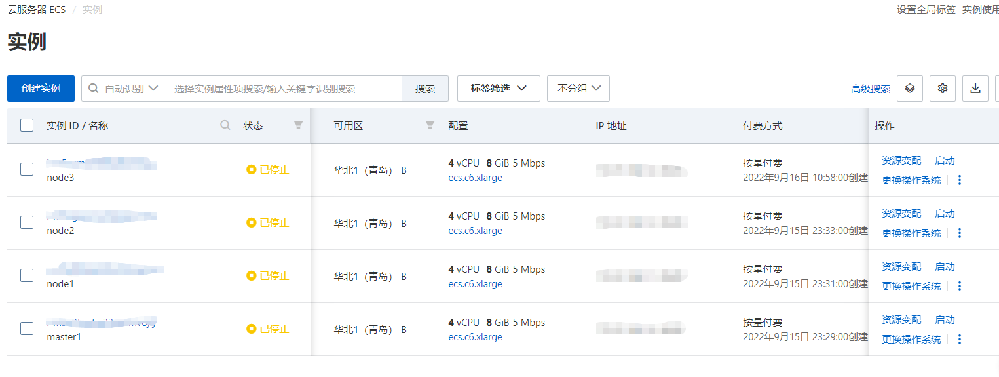
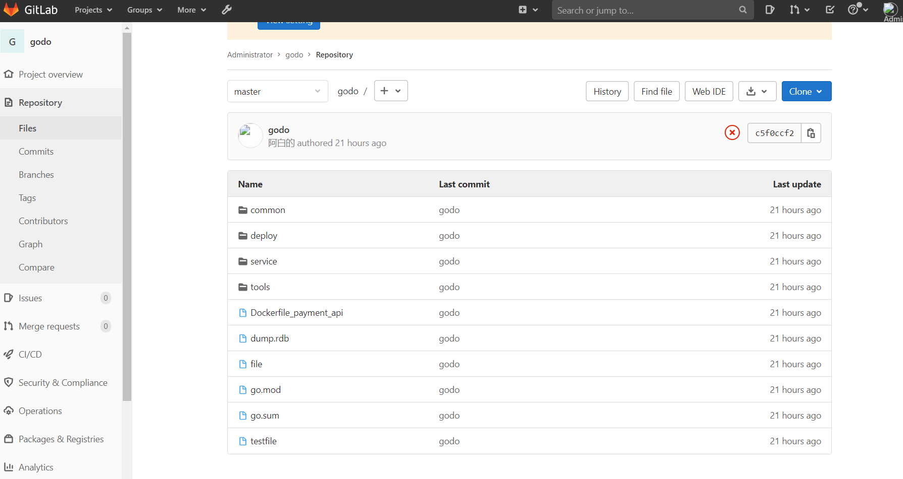
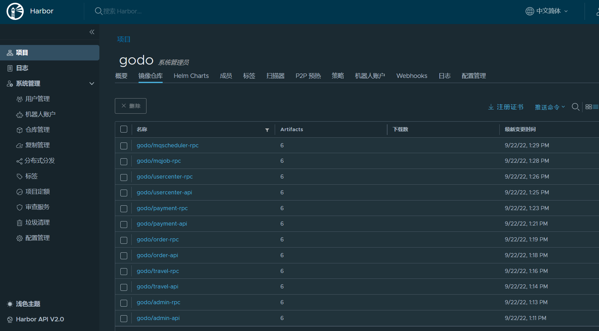
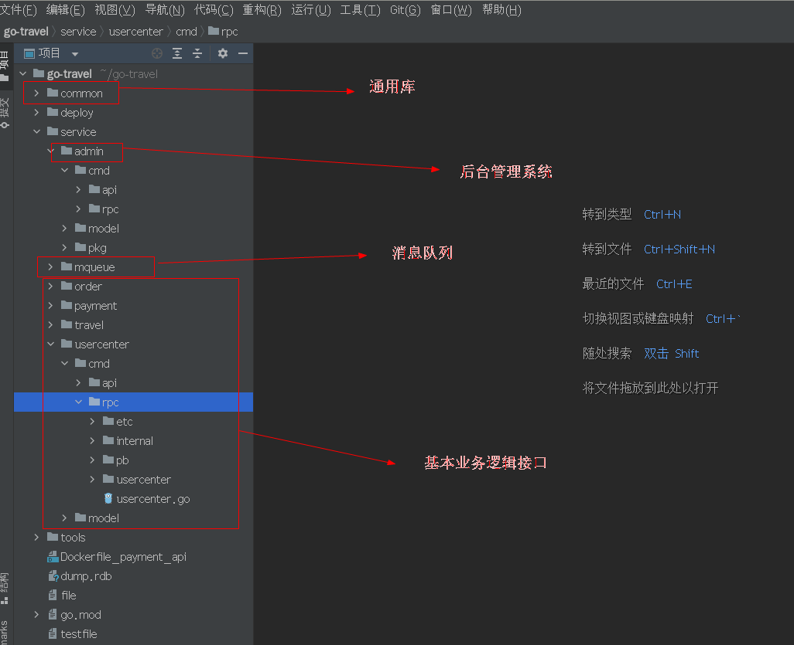
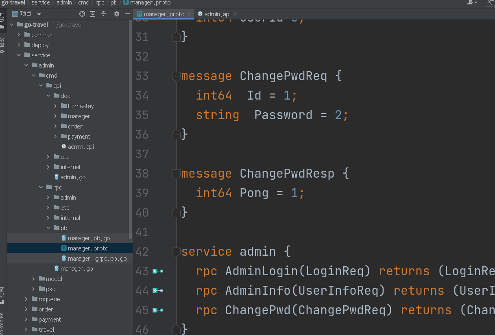
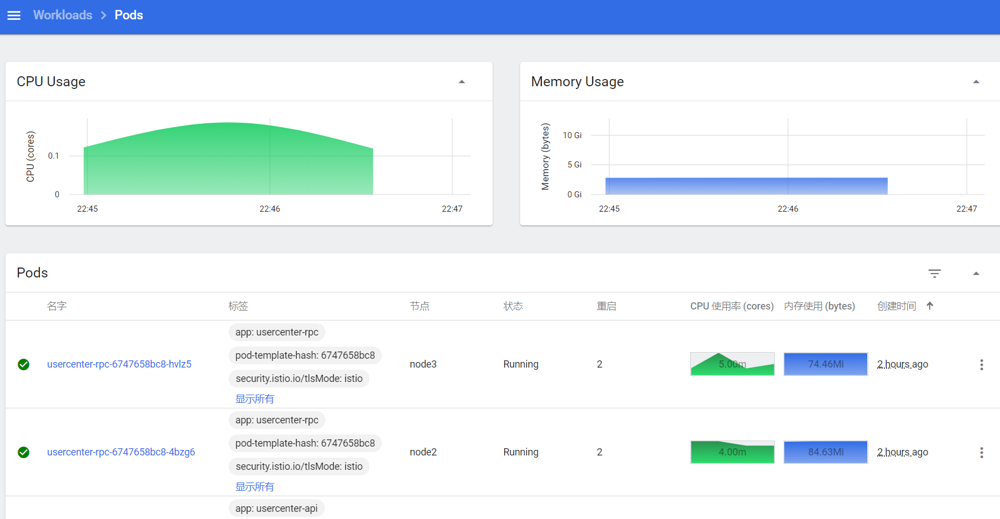
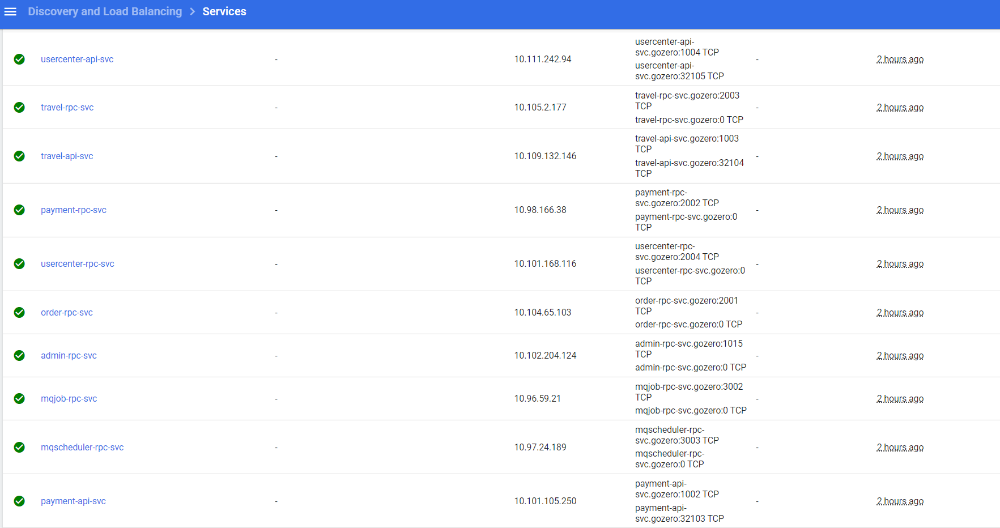
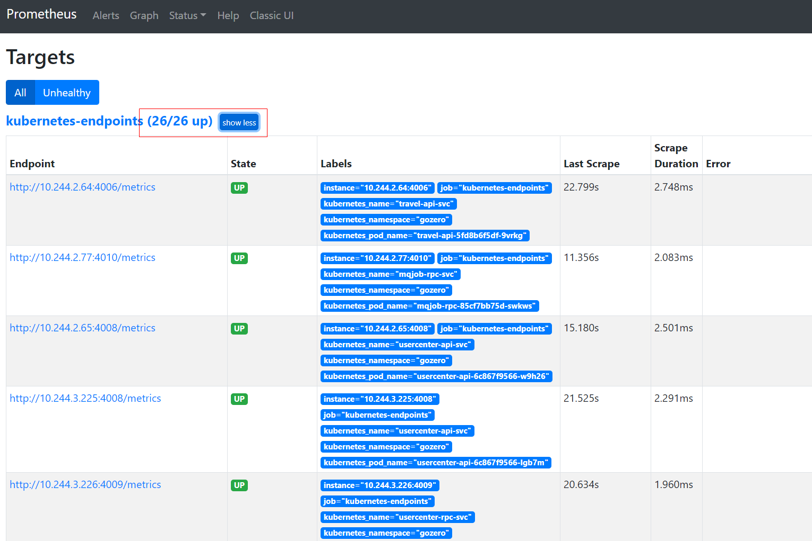
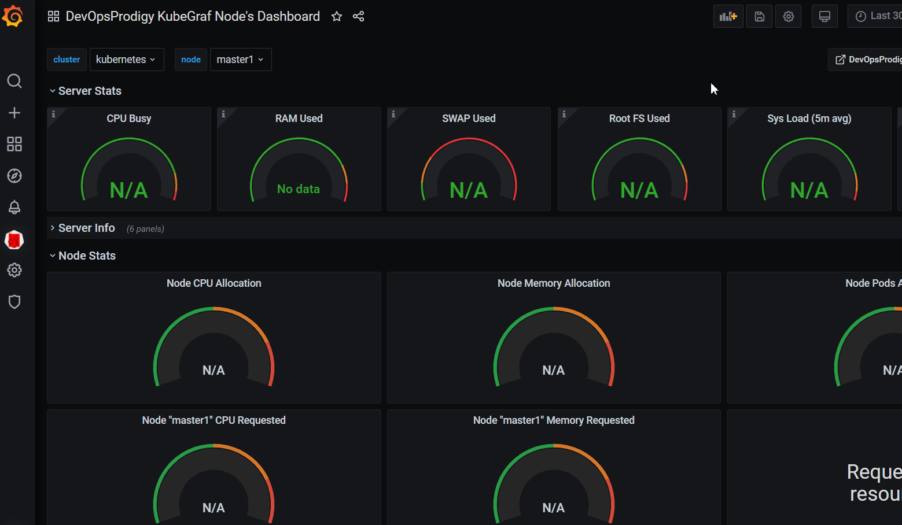
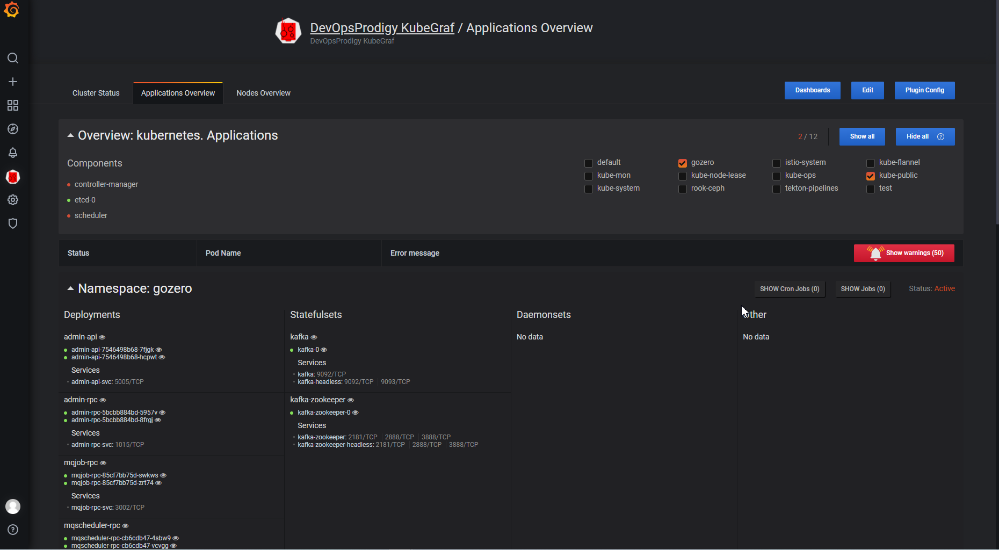

# yys

#### 介绍
一个云原生项目，模拟一条完整的云原生生产线，涉及到各类云原生知识，k8s，容器化，go微服务开发，运维，服务网格istio，存储集群，日志系统，监控系统，devops等 

主要的知识点技术点：  
云原生基础环境：k8s docker linux  
微服务开发：go go-zero istio  
CI/CD：tekton gitops  
存储：rook-ceph nfs共享卷  
监控：prometheus+grafana+alertmanager  
日志：ELK Loki  
其他：mysql redis kafka ansible等  

整个项目高度容器化，k8s是基石环境，采用go语言go-zero框架编写的微服务架构的应用程序(当然这里单体和微服务之间的转换很平滑,为了更明显突出servicemesh效果我优先考虑了微服务架构)，主题上可封为两大部分，后台管理系统和服务应用，在支付和订单的逻辑处理间为了保证消息数据的正确使用，接入kafka做消息队列，部分延时功能用ansyq做延时队列，运行在istio中，做流量管理负载均衡、安全管控、链路追踪、故障注入、熔断、流量镜像等。应用提供了metrics接口，prometheus拉取metrics数据做监控grafana可视和告警通知等。使用ceph集群和nfs共享卷做存储，为了更优化本地程序的性能，部分程序采用localpv。tekton配合我本地配置的gitlab和harbor做CI/CD  

我的环境：4台各4核8g的ESC  
  
通过我的公网地址和对应的端口即可访问我对外提供的服务，上面我提到的服务大部分对外开放(后续我考虑将服务端口整理出来供网友公网访问)

个人预计后续优化：  
1.将程序做成helm包，或者使用operator来实现更贴近云环境的开发  
2.接入dapr，更好的开发微服务  
3.配置Loki，轻量且高效  
4.加入gitops,tekton+gitops理念实现更真实的CI/CD。jenking使用kubernetes插件来配置云做cicd(无他，使用用户量在，但我觉得kubernetes用jenkins做cicd有点重)  
5.缓存相应的代码逻辑进一步设计优化，缓存设计不好并发就是空谈  
6.数据库换osd，有istio接入，实现更好的高可用，更方便实现如读写分离等操作  
7.监控promenthues+grafana+alertmanager不够轻，采用promentheusOperator或者Thnos  

#### 放下部分图片介做绍  

链路追踪可视：  
  
  

CI/CD:  
  
  
  

业务逻辑：  
  
  

相应的service:  
  
  

监控：  
  
  
  
